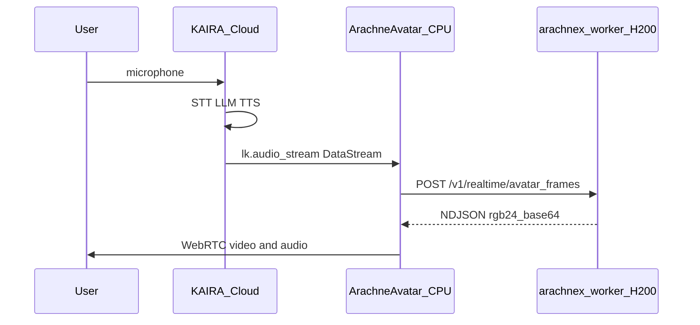

# ARACHNE avatar worker with KAIRA (LiveKit Cloud)

KAIRA stays the voice brain (Deepgram STT, OpenAI LLM, ElevenLabs TTS). A separate **CPU** LiveKit agent runs `AvatarRunner`, streams TTS audio to **RunPod H200** `arachnex-worker`, and publishes synchronized video+audio to the room.

## Architecture



## Components

| Piece | Where | Entry |
|-------|--------|--------|
| KAIRA | LiveKit Cloud | `src/agent.py` |
| ARACHNE avatar worker | LiveKit Cloud (second agent) | `src/arachne_avatar_worker.py` |
| DiT inference | RunPod H200 | `NULLXES ARACHNE X ULTRA/ARACHNE-X/services/arachnex-worker` |

## Environment variables

### Enable on KAIRA agent (Cloud secrets)

| Variable | Required | Description |
|----------|----------|-------------|
| `KAIRA_AVATAR_BACKEND` | yes | Set to `arachne` (default / unset keeps Anam when `ANAM_AVATAR_ID` is set) |
| `NULLXES_AVATAR_INFERENCE_URL` | yes | H200 worker base URL, e.g. `https://your-pod:9090` |
| `NULLXES_AVATAR_INFERENCE_SERVICE_KEY` | yes | Same key as worker `NULLXES_INFERENCE_SERVICE_KEY` |
| `KAIRA_ARACHNE_AVATAR_AGENT_NAME` | no | Dispatch target; default `KAIRA-ARACHNE-AVATAR` |
| `KAIRA_ARACHNE_AVATAR_IDENTITY` | no | Avatar participant identity; default `kaira-arachne-avatar` |

### ARACHNE avatar worker agent

| Variable | Description |
|----------|-------------|
| `LIVEKIT_URL`, `LIVEKIT_API_KEY`, `LIVEKIT_API_SECRET` | Same as KAIRA |
| `KAIRA_ARACHNE_AVATAR_AGENT_NAME` | Must match Cloud agent name |
| `KAIRA_ARACHNE_AVATAR_IDENTITY` | Must match KAIRA `DataStreamAudioOutput` destination |
| `KAIRA_AGENT_IDENTITY` | Optional; else read from dispatch metadata |

### Inference tuning (both agents)

| Variable | Default |
|----------|---------|
| `KAIRA_ARACHNE_PORTRAIT_PATH` | `assets/kaira_face.png` |
| `KAIRA_ARACHNE_RESOLUTION` | `480p` |
| `KAIRA_ARACHNE_INFERENCE_STEPS` | `8` |
| `KAIRA_ARACHNE_PROMPT` | empty |
| `NULLXES_AVATAR_INFERENCE_FRAMES_PATH` | `/v1/realtime/avatar_frames` |

Replace `assets/kaira_face.png` with your Kaira portrait PNG (git-tracked).

## Deploy (Cloud + RunPod only)

### 1. H200 RunPod

Follow [NULLXES_ARACHNE_RUNPOD_27-05-2026.md](../NULLXES%20ARACHNE%20X%20ULTRA/ARACHNE-X/Documentation/NULLXES_ARACHNE_RUNPOD_27-05-2026.md): build `arachnex-worker`, expose `:9090`, set checkpoint dir and inference service key.

### 2. Second LiveKit Cloud agent (avatar worker)

1. In LiveKit Cloud, create agent **KAIRA-ARACHNE-AVATAR** (or your name).
2. Copy agent id into [livekit.arachne-avatar.toml](../livekit.arachne-avatar.toml).
3. Deploy with the same image/secrets as KAIRA but start command:

   `uv run src/arachne_avatar_worker.py start`

   Example:

   ```bash
   lk agent deploy --config livekit.arachne-avatar.toml --yes
   ```

### 3. KAIRA agent

Add Cloud secrets (`KAIRA_AVATAR_BACKEND=arachne`, inference URL/key). Redeploy KAIRA:

```bash
lk agent deploy --yes
```

Do not change unrelated secrets.

### 4. Frontend

Subscribe to the avatar participant video track (identity `kaira-arachne-avatar` by default). KAIRA agent audio is routed through the avatar worker (`audio_output=false` on KAIRA when ARACHNE is active).

## Opt-out

Unset `KAIRA_AVATAR_BACKEND` or set `anam` behavior: with `ANAM_AVATAR_ID` set, Anam is used as before. Telephony rooms never enable ARACHNE or Anam.
